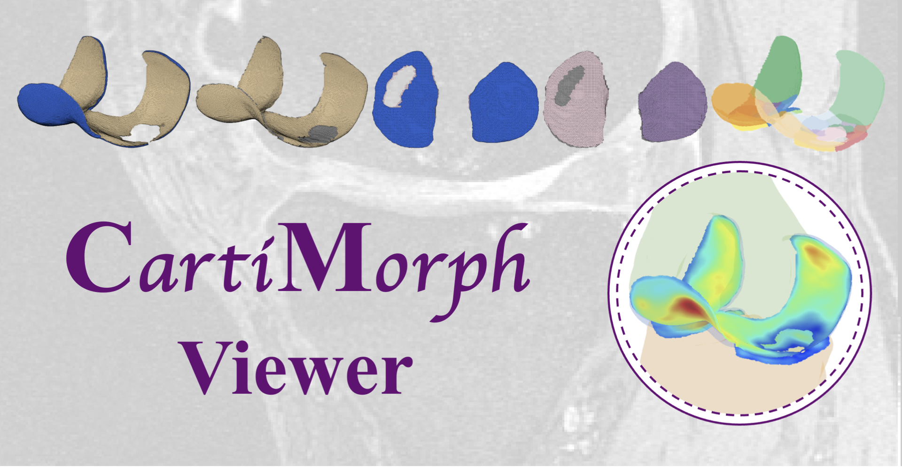

# CartiMorph Viewer

<div style="text-align:center">  </div>

## Release

- [v1.0.5](https://github.com/YongchengYAO/CartiMorph-Viewer/releases/tag/v1.0.5) (latest)

## Introduction

**CartiMorph Viewer (CMV)** is part of the [**CartiMorph Toolbox (CMT)**](https://github.com/YongchengYAO/CartiMorph-Toolbox) and the [**CartiMorph**](https://github.com/YongchengYAO/CartiMorph) project. It was originally a component of the CartiMorph Toolbox, designed for visualizing some intermediate and final results from CMT. Thus you need the `Results` folder from CMT. As part of CMT, the CMV can be launched directly from the UI of CMT once all computation tasks are finished. 

Considering the scenario where users may wish to share their results generated by CMT with collaborators, we provide this **standalone version of CMV** to help with data sharing and collaboration – one party with the computing resource can do the data analysis with CMT and share the `Results` folder with other teams. CMT runs on Linux (either a local machine or computing server/cluster), while CMV supports macOS and Linux. For Windows users, you can launch the application in Matlab with the source files under `src-code`.

We value data privacy when designing CMV. Patient data is strictly excluded from the `Results` folder unless raw NIfTI file names contain sensitive information. Furthermore, no NIfTI files are included.

## Installation

### How to install CMV on Linux?

```bash
chmod u+x CartiMorphViewer-linux-standalone-v1.0.5.install
./CartiMorphViewer-linux-standalone-v1.0.5.install
```

Check the [post-installation instructions page](https://github.com/YongchengYAO/CartiMorph-Viewer/blob/main/Documents/post_installation_linux.md) for setting environment variables and aliases, and solving library conflicts.

### How to install CMV on macOS?

1. Download `CartiMorphViewer-macOS-standalone-v1.0.5.install.app.zip`
2. Unzip the downloaded file by double-clicking or via command 

   ```bash
   unzip CartiMorphViewer-macOS-standalone-v1.0.5.install.app.zip
   ```
3. :fire: Since macOS adds a `com.apple.quarantine` attribute to files downloaded from the internet, marking them as untrusted, we can remove the attribute via 

   ```bash
   sudo xattr -rd com.apple.quarantine CartiMorphViewer-macOS-standalone-v1.0.5.install.app
   ```
4. Now you can double click to install CMV on macOS.

## Features

- support Linux (tested on Ubuntu 22.04.2 LTS ) and macOS (tested on Sonoma 14.4)
- visualisation
  - reconstructed cartilage surface
  - pseudo healthy cartilage surface
  - surface normal
  - cartilage subregions
  - cartilage thickness map
  - MR image and subregional masks 
  - quantitative results for cartilage morphometrics

## Example Results from CMT

Try CMV with our [example results](https://github.com/YongchengYAO/CartiMorph-Viewer/tree/main/Examples-CMV) from the CMT. Just unzip the file and select the top-level folder in CMV.

## Step-by-step Instructions

<div style="text-align:center">  </div>

For detailed instructions, please go to [this page](https://github.com/YongchengYAO/CartiMorph-Viewer/blob/main/Documents/instructions.md).

## Citation

If you use the toolkit, please cite the CartiMorph paper.

```
@article{YAO2024103035,
title = {CartiMorph: A framework for automated knee articular cartilage morphometrics},
journal = {Medical Image Analysis},
author = {Yongcheng Yao and Junru Zhong and Liping Zhang and Sheheryar Khan and Weitian Chen},
volume = {91},
pages = {103035},
year = {2024},
issn = {1361-8415},
doi = {https://doi.org/10.1016/j.media.2023.103035}
}
```


